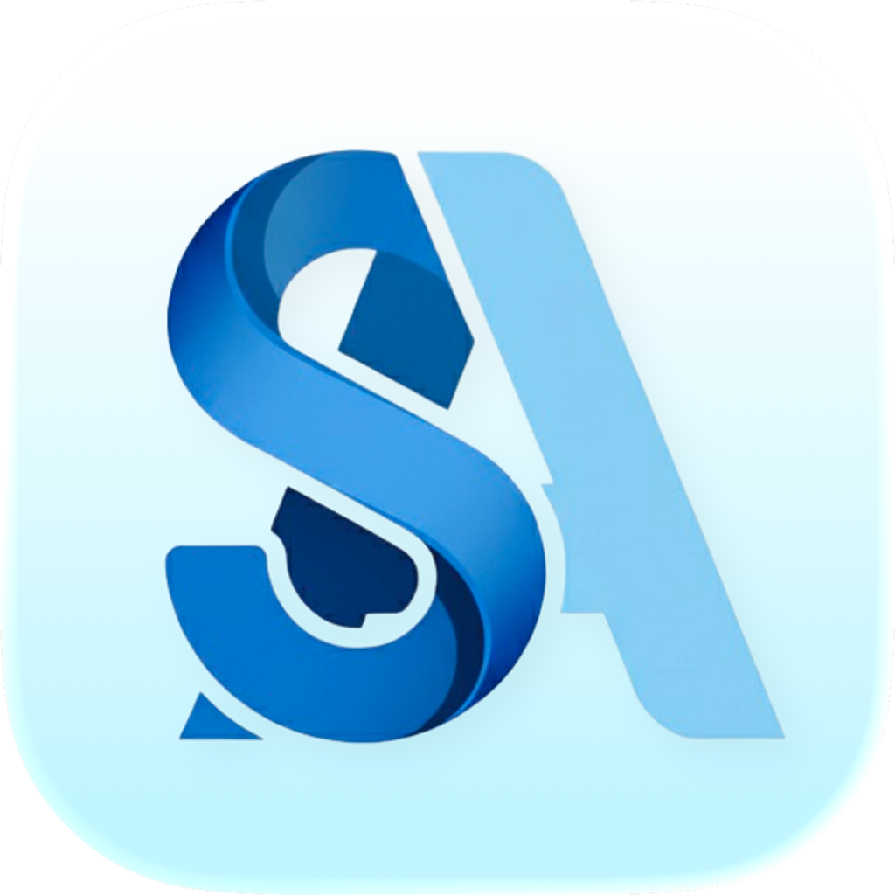

# SpotlightAds

**SpotlightAds** is a powerful desktop application designed to automate Apple Search Ads management for indie developers and small app teams.

Stop wasting hours on manual keyword research and bid adjustments. SpotlightAds helps you optimize your campaigns, improve your App Store presence, and maximize your ROI with intelligent automation.

> **Powered by Advanced AI & Expert Insights**

## 🚀 Key Features

- **Automated Apple Search Ads**: Launch optimized campaigns in one click. No ASA expertise required.
- **AI Keyword Discovery**: Automatically find brand, generic, competitor, and long-tail keywords.
- **Weekly Optimization**: Pause underperformers, boost winners, and discover new opportunities weekly.
- **App Metadata Analysis**: Get actionable recommendations to improve your App Store presence.
- **Keyword Competitiveness Insights**: See difficulty scores, search volumes, and competitor rankings.
- **Smart Budget Management**: Set daily and total budgets with automatic reallocation to top performers.
- **Clear Analytics Dashboard**: Beginner-friendly reports that show what matters: installs, spend, and ROI.
- **Campaign Health Scores**: Monitor campaign performance with easy-to-understand quality scores.
- **Cross-Platform**: Available as a native desktop application for both macOS and Windows.

## 📥 Download & Install

Download the latest version for macOS and Windows from our [Releases page](https://github.com/hmduc1603/spotlight-ads/releases).

## 🔄 Auto-Updates

SpotlightAds comes with a built-in auto-updater. Once installed, the application will automatically check for updates and notify you when a new version is available, ensuring you always have the latest features and improvements.

## 🤝 Support

If you encounter any issues or have questions, please reach out to our support team:

- **Email**: info@spotlightads.com
- **Website**: [https://spotlightads.co](https://spotlightads.co)

---

&copy; 2024 SpotlightAds. All rights reserved.
